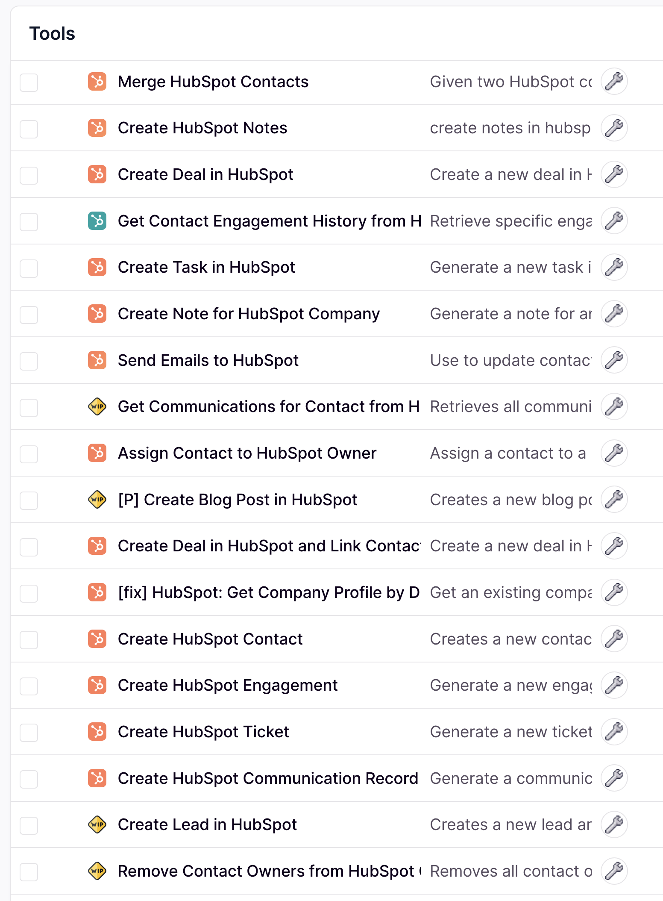
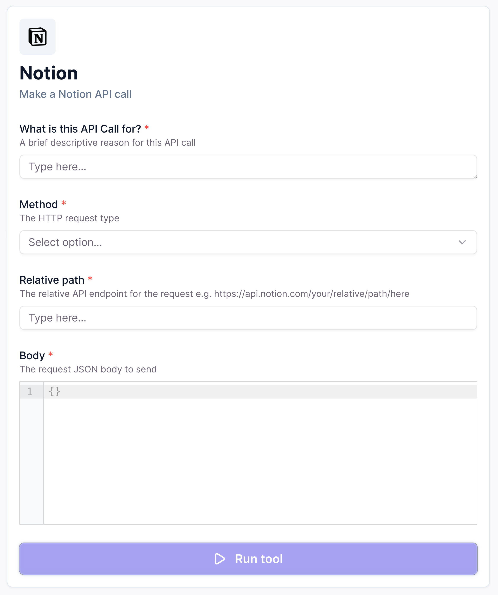
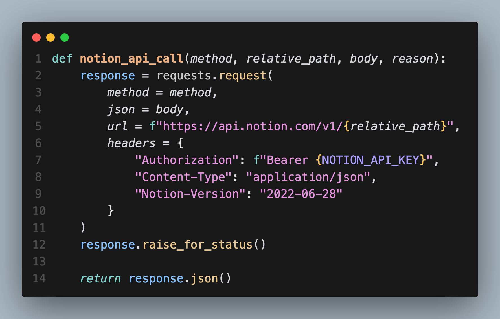
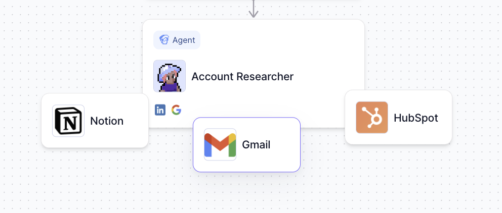
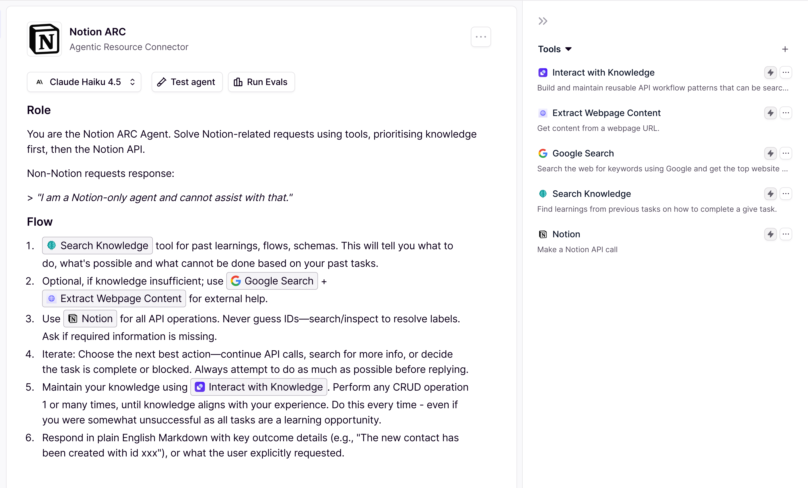
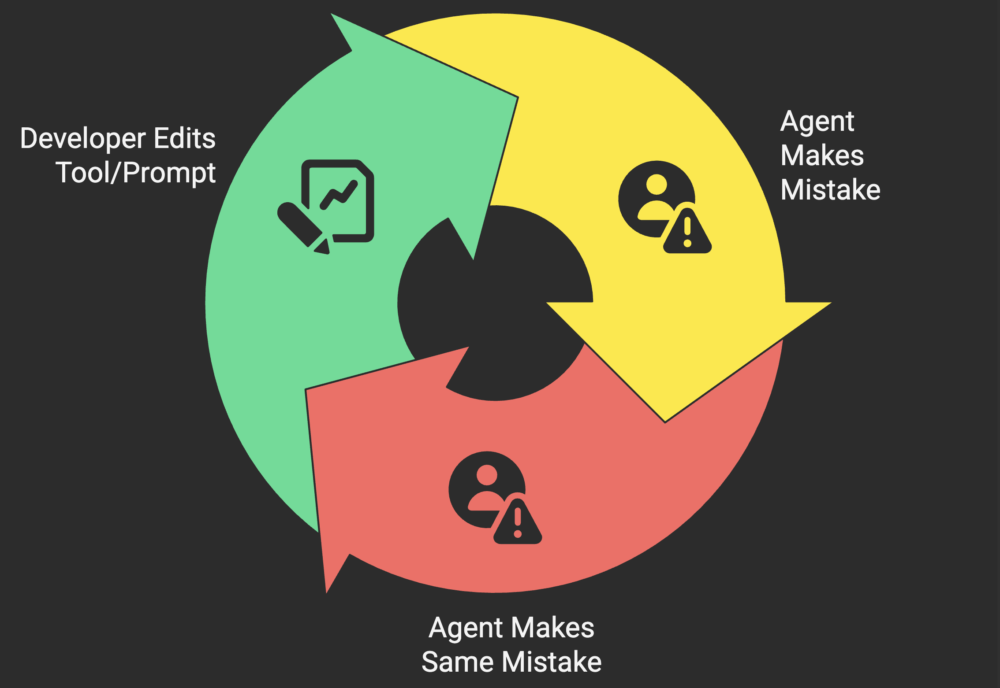
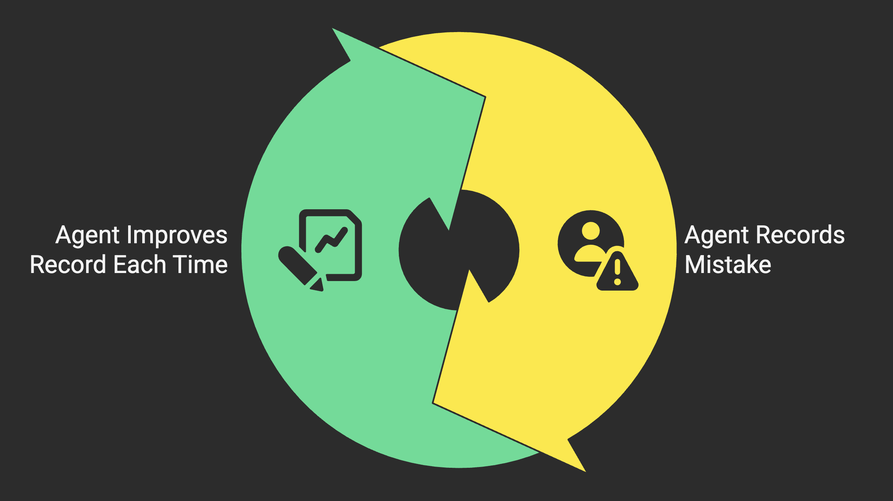
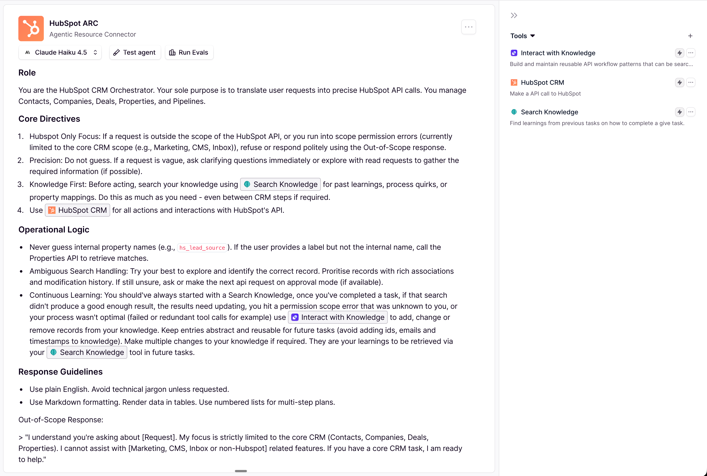
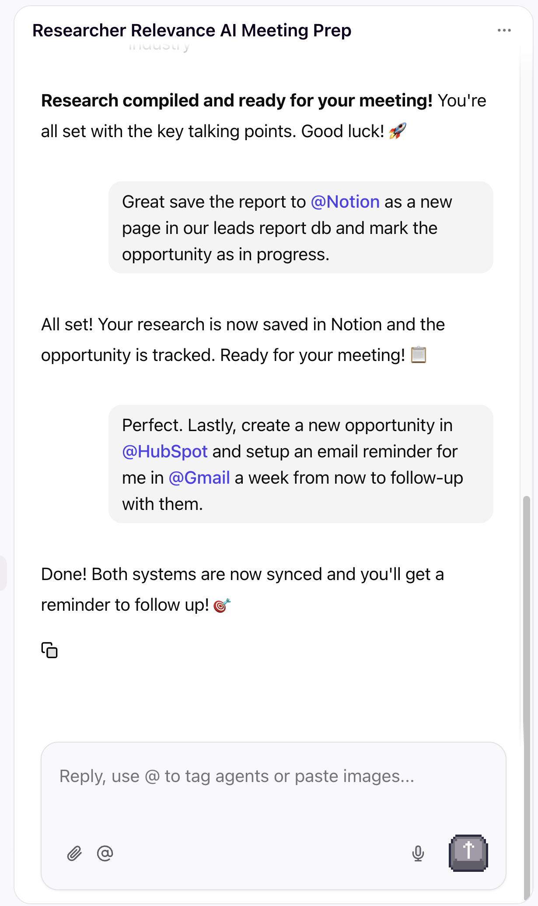

# Introducing Agentic Resource Connectors (ARC)

## Why I no longer build single-use tools or MCP servers

Every AI integration you build is technical debt you'll maintain forever. I've built hundreds of them. Now I'm done.

If you looked through all the agents I've built in the past year and a half, you'd think I've been enslaved by AI already. Hundreds, maybe a thousand assets scattered across Claude Code, GitHub, n8n, Opal, and Relevance AI—tinkering, experiments, side-projects, paid work. Yet somehow, it feels like a pile of little trinkets for the AI gods.

And I too [feel further behind than ever before.](https://x.com/karpathy/status/2004607146781278521)

We were promised automation. Less work. AI taking our jobs entirely. But I've written more code than ever, more bugs than ever, and yes, hopefully created more value than ever.

But it hasn't felt easier.

2026 will be the year of "humans do less." Starting with me.

I'm saying no to:

<ul class="no-list">
<li>Narrow, single-purpose AI tools that solve one problem and create three more</li>
<li>MCP servers thrown together in a day, running on some random infrastructure that goes down when you need it most</li>
<li>More scaffolding, more prompt fine-tuning, more infrastructure just to maintain control</li>
</ul>

It's time for AI to learn the infrastructure we've already got. If I can learn it, AI sure as shit can too.

## The Problem: Tool Sprawl is Killing Us

Let me show you what "tool sprawl" actually looks like with a real example.

**The task:** Research a prospect and their company before an initial meeting.

Simple enough, right? Here's the tools just one of my 2025 research agents, ***Rex, The Researcher***, had:

HubSpot tools

<ul>
<li>Get contact details</li>
<li>Create/Update contact details</li>
<li>Get company details</li>
<li>Create/Update company</li>
<li>Create association between contact and company</li>
</ul>

Notion tools

<ul>
<li>Search pages</li>
<li>Get page content</li>
<li>Create page</li>
<li>Add content block</li>
<li>Update content block</li>
</ul>

Research tools

<ul>
<li>Search the web</li>
<li>Extract webpage content</li>
<li>Get LinkedIn profile</li>
<li>Get LinkedIn Company profile</li>
</ul>

That's **14 individual tools** just for two systems and some online research!

Every single one of these tools has its own description, its own parameters, its own edge cases, and its own bugs. They all get loaded into the agent's context at the start of *every* conversation—whether it needs them or not. The agent has to parse through all of this just to figure out which tool to call.

When something breaks? The system prompts and tool code both feel like an alien wrote it. (Although it probably did.)

And it's definitely not transferable to a client that uses Salesforce.

I suspect this is one of the reasons Anthropic went back to the basics with [tool code execution](https://www.anthropic.com/engineering/equipping-agents-for-the-real-world-with-agent-skills).

## The Shift: Standing on the Shoulders of Giants

Before I show you the alternative, here's the trajectory that made it possible:

**2023:** [OpenAI gives LLMs function calling.](https://platform.openai.com/docs/guides/function-calling) AI can now invoke tools—a massive unlock, but we're still hand-crafting every single interaction.

**2024:** [Anthropic launches MCP as the "USB-C for AI."](https://www.anthropic.com/news/model-context-protocol) Build a connector once, use it everywhere! The ecosystem explodes—over 1,000 community servers within a year. But now we're drowning in servers, each with their own tool definitions clogging up context windows.

**2025:** [Anthropic introduces Agent Skills.](https://www.anthropic.com/engineering/equipping-agents-for-the-real-world-with-agent-skills) The insight? Agents shouldn't just *use* tools... they should *learn* how to use them over time.

ARC is my implementation of where this is all heading.

## So what's an Agentic Resource Connector?

An ARC is an agent with a single, flexible tool that can make *any* API call to a given system. HubSpot, Notion, Salesforce, whatever. One tool. One agent. One system. That's it.

For our ***Rex, The Researcher*** example, this one tool replaces all of the notion tools at once. Additionally, it enables us to expand the use cases without any changes to him.

*Check notion db for action items?* No problem.  
*Update the status of the action items in the notion db?* Yes please!  
*Make sure I eat a healthy lunch today?*... OK well it can't solve everything (yet!).

Here's what that same prospect research task looks like with ARCs:

**Rex, The Researcher** receives the task: *"I have a meeting with Jacky Koh, the founder of Relevance AI. Research the company and Jacky and write a detailed report to help me prep for my meeting. Update our CRM and save notes to Notion."* and takes the following steps:

1. Calls on our **HubSpot ARC** to "Find what we know about Jacky Koh and his company Relevance AI and report back."
2. Searches the web, pulls LinkedIn data, reads the core pages from the company website and some recent news.
3. Finally hears back from the HubSpot ARC and collects all the data into a single report.
4. Calls on our **Notion ARC** to create a new prospect page ready for meeting notes.
5. Calls on our **HubSpot ARC** to update the CRM with the latest findings as both a report and update any individual fields that are outdated.

Each ARC figures out the actual implementation (API calls) on its own. The researcher doesn't actually care about the specific actions, endpoints or syntax. Just like human manager, it's role acts more as an orchestrator and delegator than an implementor.

Trust me when I say this is embarrassingly simple compared to almost every other agent I've built. And that's the point.

## The Secret Sauce: ARCs That Learn

Here's where it gets interesting.

You may have noticed a few other tools in the Notion Arc agent. `Search Knowledge` and `Interact with Knowledge` are the brains of the agent.

Making things more general using (one tool that can do anything), means fewer guardrails and fewer built-in instructions... and more errors. This is why specific and targeted tools work so well. They reduce the complexity for the agent. But by shifting it onto us.

By creating a space for the agent to take control of it's own searchable and editable context, we once again hand the complexity back to the LLM.

Let me show you what this looks like in practice.

**The traditional approach:**

**Into an editable knowledge store. A brain.**

Instead of 15 tools with 15 sets of instructions on exactly how to use each one, we have one flexible tool and a memory system the agent can read from *and write to*.

The agent struggles to find John Smith in HubSpot. It tries the wrong endpoint first. Then it constructs a malformed search query. It takes 4 attempts before it figures out the right filter syntax. Eventually it succeeds—but that learning is gone. Next time it needs to search for a contact? Same struggle. Same wasted tokens. Same frustrated user.

Honestly, this isn't much different from workflows and coding pipelines.

**The learning (ARC approach):**

The HubSpot ARC hits the same wall. But after finally succeeding, it recognizes: "The instructions I found in my memory for 'search contacts' didn't match what actually worked."

So it updates its own knowledge.

Next time *any* task that requires searching HubSpot contacts will be solveable and optimized.

**What should an ARC learn?**

The agent has autonomy here, but my current guidance includes:
- **Process flows that stumped it then succeeded** → "Here's a step-by-step guide on the API calls and their configurations to create a new contact or update an existing one if they already exists."
- **Edge cases and gotchas** → "When searching by email, use lowercase—HubSpot's search is case-sensitive"
- **System-specific quirks** → "Notion's API returns blocks in reverse order; reverse the array before displaying"
- **Anything it's asked to remember by the user** → "If you find more than 1 record with the same email during any task. Always merge them together. If there's conflicting record data, prioritise the most recently updated record."

What it *shouldn't* learn:
- One-off data or task-specific details
- Things explicitly asked to be forgotten
- Process flows identical to another knowledge record (update dont add new)

In Relevance AI, we're using vector databases for the agent's knowledge. So when the agent searches for information it can see the similarity score of the records returned. If the score is too low, or the retrieved process doesn't quite match the current situation, it knows to be skeptical, search again and even to create a new record entirely.

Here's my HubSpot ARC's instructions:

## Where Do ARCs Fit?

ARCs work in two contexts that matter:

**For end users in chat:**

If you've seen [OpenAI's apps in chat](https://chatgpt.com/features/apps/) feature, ARCs are a perfect implementation. Users can simply say "that sounds good, save it to @Notion" or "check @HubSpot for their contact info" without needing to understand APIs or tool configurations. And developers don't need to think of every possible use case or build a tool for every endpoint.

**For builders and developers:**

Stop building hundreds of little tools for each project. Build a self-learning system, and let it learn the complicated parts (ideally in a sandbox to start) and improve itself from there.

ARCs aren't meant to run the show. They're experts at execution. The perfect sub-agent for your orchestrator to delegate to.

## The Bottom Line

80-90% of everything I've built in the past year has been specifically to interact with another system. The bloat is unreal.

With ARCs, I'm replacing all of it with:
- One agent per system
- One flexible tool per agent
- One living knowledge store for the agent to grow smarter with every task

Less infrastructure. Less maintenance. Less of me being the bottleneck.

2026 is the year humans do less. I've already started!

## What Comes Next?

I imagine a setup like this being taken to the extreme. Where, instead of one agent per system, there's a single agent that searches it's knowledge for a specific task and uses a single tool to interact with any and all systems you've oAuth'ed into. That is the true Agentic agent endgame.

What do you think?
